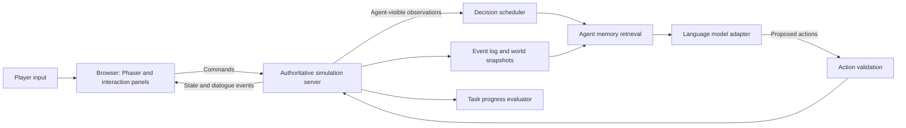

Generative Agent Town — Implementation Plan

Prepared 2026-09-06. Status: the first playable 2.5D isometric application is implemented, with original assets, five residents and a player, walking, proximity conversations, personal memories, daily routines, physical tasks, and SQLite save/resume. Run `python run.py` and open http://127.0.0.1:8766/. See README.md for configuration and current limits. The separate asset-preview.html remains an art inspection harness.

**Implemented scope versus roadmap.** The first playable uses dependency-free browser JavaScript and Canvas, a Python standard-library HTTP server, server-sent events for state, JSON commands, and SQLite. This keeps local setup to one command. The Phaser, TypeScript, Tiled, FastAPI, and WebSocket stack below remains a proposed migration for a larger application, not a description of the current code. Memory retrieval currently combines lexical similarity, recency, and importance; embedding retrieval is still planned. The workspace is configured for local live cognition through Ollama using the installed gemma4:31b model. Native Ollama JSON-schema requests support task interpretation, conversations, activity choices, and reflection, with one inference worker and priority for player requests over queued background work. Direct live tests passed for all four cognition methods with gemma4:31b (approximately 12–29 seconds per warm response). Offline rules remain available through AGENT_PROVIDER=demo. The optional OpenAI Responses API adapter is retained and has only been tested with mocked provider responses.

The implemented task set is delivery of coffee/parcels, visiting places, meeting residents, and waiting. The server checks actual pickup, proximity, inventory transfer, and conversation events before reporting completion. It supports cancellation, closed-cafe recovery, stale-decision rejection, private memory retrieval, a model request budget, and autosave. Twenty-six automated tests and a running-server delivery check pass. The original art preview was visually reviewed; a browser automation failure prevented a visual recheck of the new application UI. Remaining work includes embedding retrieval, stronger reflection and hierarchical planning, layered interiors, richer interactions, deterministic replay, multi-agent coordination, and a believability evaluation against the paper. The sections below describe that wider target and should not be read as a completed-feature list.

Build a local, single-player, 2.5D isometric browser simulation with five autonomous residents, a controllable visitor, visible walking, proximity conversations, and tasks assigned through interaction. Use one neighborhood containing a cafe, park, shop, and two homes. Create all visual assets specifically for this project. Use a fixed isometric camera with pan and zoom, raised buildings, diamond ground tiles, and eight-direction character animation. Treat tasks as actions inside this simulated world. External software tasks would require a separate tool-execution layer and are outside this initial scope.

The research reference is [Generative Agents: Interactive Simulacra of Human Behavior](https://arxiv.org/html/2304.03442v2). The design below is an engineering proposal for this project, not a claim that these implementation choices were evaluated in the paper. It is a product-oriented adaptation, rather than an exact reproduction experiment.

Use the [authors' repository](https://github.com/joonspk-research/generative_agents) to understand the original prompts and simulation organization. Its documented workflow uses a Django environment server, a separate simulation server, step-based execution, and replay. Build the interactive application around an explicit simulation API so the player can interrupt agents and receive live progress updates.

**Technical choices.** Use TypeScript and [Phaser](https://docs.phaser.io/phaser/getting-started/what-is-phaser) for the browser world; Phaser is designed for 2D browser games. Use ordinary HTML controls alongside the canvas for the chat panel, task list, and agent inspector. Author the map in [Tiled](https://doc.mapeditor.org/en/stable/manual/introduction/) with separate visual, collision, semantic area, spawn, and interaction-point layers. Use Python and FastAPI for the simulation service, with [WebSockets](https://fastapi.tiangolo.com/advanced/websockets/) for commands and state updates. Start with SQLite and in-process vector similarity for memory retrieval. Move to a dedicated vector index or database only when measured retrieval latency warrants it.

Keep the model integration behind an interface with decide, converse, reflect, and embed operations. Select a model by testing structured-action validity, persona consistency, task completion, response latency, and token usage on the same scenarios. No model training is required for the initial version. Store provider credentials on the server through environment configuration.

**Isometric presentation.** Retain a logical world grid on the server and project it only for rendering. Use a 2:1 diamond projection, commonly called game isometric, with a nominal tile width of 128 and height of 64 pixels. For grid coordinates (x, y), screenX = originX + (x - y) * 64 and screenY = originY + (x + y) * 32 - elevationPixels. Convert pointer coordinates back through camera pan/zoom and the inverse ground projection before pathfinding. Navigation, proximity, hearing, and task distances operate in world coordinates. Allow eight-neighbor movement with diagonal cost sqrt(2), and forbid diagonal corner cutting through blocked orthogonal neighbors. Choose sprite facing from projected velocity.

Anchor characters at their feet and sort small objects by their ground contact point. Split large buildings into roof, wall, and ground components where required for correct occlusion; one sprite-depth number cannot resolve every overlapping multi-tile building. Fade roofs and foreground walls when the player or selected resident is inside. Keep speech bubbles and task markers in an overlay that follows the visible character. Initial scope is a single walkable ground level; decorative height does not imply navigable upper floors or camera rotation. Phaser supports isometric tilemaps; its coordinate conversion requires both world coordinates through worldToTileXY. See [Phaser Tilemap API](https://docs.phaser.io/api-documentation/class/tilemaps-tilemap). Tiled object coordinates require an explicit import conversion, as described in its [layer documentation](https://doc.mapeditor.org/en/stable/manual/layers/).

**Original asset production.** Generate the raster artwork with the built-in image generation tool and author simple interface icons directly as SVG. Produce isometric terrain, buildings, foliage, furniture, usable objects, and six distinct characters. Keep one projection and lighting direction throughout. Character sheets need consistent frame bounds, feet anchors, facing order, and walk-cycle timing. Preserve source images and prompts, and publish a manifest of actual source rectangles and display dimensions. Inspect alpha, frame alignment, silhouette, tiling, and animation before marking a sheet ready. Generated artwork must not be assumed to meet requested pixel dimensions automatically. The earlier top-down texture draft is superseded by this isometric specification.



**World execution.** The server owns position, inventory, object state, simulated time, capacity, opening hours, action duration, and task completion. The model selects an action and target from known capabilities; it cannot directly change coordinates or declare world facts true. Implement movement using A* over the collision grid, with walkable interaction tiles next to furniture and objects. Add short-lived reservations for doors, seats, and narrow passages, a consistent yielding rule, and a timeout that requests a new path. Report unreachable destinations as action failures.

Start with actions move_to, talk_to, wait, inspect, pick_up, give_item, and use_object. Every action defines valid arguments, preconditions, expected duration, world effects, interruptibility, and a success or failure event. Object interactions use a registry: a coffee machine can produce coffee only when the agent is adjacent, the machine is available, and required supplies exist. Unsupported actions return a useful limitation to the agent and player.

An illustrative model result is:

```json
{
  "agent_id": "maya",
  "plan_revision": 7,
  "action": "move_to",
  "target_id": "cafe_counter",
  "task_id": "task_014",
  "reason_summary": "Collect the coffee requested by the visitor."
}
```

The server supplies trusted request metadata separately, verifies the response schema and target, and rechecks preconditions when execution begins. If the plan revision has changed while the request was running, discard its result. Keep only one outstanding decision per agent. A model-authored reason is a short explanation for the inspector, not an authoritative account of hidden model reasoning.

**Timing and responsiveness.** Render at a target of 60 frames per second and run authoritative simulation updates initially at 10 Hz. Interpolate between server positions in the browser. These are starting targets to profile, not guarantees. Run cognition on events: an action finishes, a player addresses the agent, a relevant encounter occurs, a task changes, or a scheduled activity becomes due. Never issue a model request on every animation frame or every simulation tick.

Keep wall time and simulated time separate. Movement, appointments, task deadlines, and action durations all use the same simulated clock. Pause stops simulated progress; a returned model result is queued and revalidated on resume. In the initial interactive mode, use a conservative speed and slow down when decision backlog grows. Do not promise arbitrary fast-forward while waiting on live model calls. Show waiting or thinking states and allow the player to pause during conversations. Provider timeouts cause bounded retries followed by a safe wait or continuation of an already valid action.

**Agent data and memory.** Give each agent a persistent identity, role, voice style, core traits, needs, current plan, known places, and personal relationships. Use the same model service for multiple agents while keeping each agent's state and prompt context isolated.

| Record | Essential fields |
|---|---|
| Agent | ID, persona, needs, position, current action, plan revision |
| Memory | ID, owner, text, kind, simulated creation/access times, importance, embedding, source event IDs, evidence status |
| Place/object | ID, parent area, interaction tiles, capabilities, availability, capacity, state |
| Plan | Agent, revision, scheduled blocks, executable near-term steps, dependencies |
| Task | Issuer, assignee, objective, priority, simulated deadline, status, steps, completion predicate, evidence |
| Conversation | ID, participants, current speaker, transcript, status, interruption state |
| Event | Sequence, simulated timestamp, actor, type, payload, visibility recipients, related task |

Build each prompt from persona, current observations, active task, near-term plan, and a bounded selection of memories. Restrict retrieval by owner and knowledge access before ranking. Include current commitments directly so embedding search cannot accidentally omit an urgent task. Rank historical memories by a tunable combination of semantic match, time decay, and importance. Start with a small memory context budget and measure relevant-memory recall on fixed questions before increasing it.

Deduplicate repeated observations such as standing near an unchanged table. Preserve distinct events such as a new conversation, an object becoming unavailable, or a promise being made. Label records as observation, reported statement, plan, or inference. Track source events and confidence for inferred beliefs; allow later evidence to supersede them. A statement such as "Noah says the shop is closed" must remain distinct from the engine's verified shop state.

Schedule reflection after accumulated meaningful events or at a quiet point in the simulated day. Generate a few evidence-linked beliefs or relationship updates, while retaining the original memories. Bound reflection depth and avoid allowing repeated reflection to turn an unsupported inference into a verified fact. Begin with daily activity blocks and expand only the next activity into executable actions. Account for travel time and existing commitments when inserting tasks.

**Visible conversations.** Nearby agents may propose a conversation based on relevance, relationship, availability, and a cooldown. The conversation manager checks proximity and participation, reserves the participants, stops them at valid positions, and turns their sprites toward each other. Generate dialogue one turn at a time from the current speaker's own knowledge and the shared transcript. Display each line in a speech bubble and in a scrollable conversation panel. Short turn and duration budgets prevent endless exchanges.

Only participants and eligible listeners receive dialogue observations. Overhearing must follow configured hearing range and room boundaries. A promise can create a proposed task or appointment, but acceptance must be represented explicitly. A statement that an item was delivered cannot substitute for a recorded transfer. On interruption, release conversation reservations and retain the completed transcript; resume the prior plan if it is still valid.

**Player interaction and tasks.** Clicking an agent selects them and opens their inspector. The visitor can walk to the agent and press an interaction key to talk. Provide two explicit input modes: Chat and Assign task. Chat can produce a suggested task, while Assign task creates a tracked request. The character acknowledges it, asks for essential missing details, negotiates timing, or declines according to its capabilities and configured autonomy policy. A developer-only director mode can force valid in-world tasks for testing.

Example: "Maya, bring a coffee to Noah in the park, then tell me when you are done."

The task planner resolves the requested item and recipient, then proposes obtaining coffee, finding Noah, walking into transfer range, giving him the item, and reporting back. Resolve Noah's location from Maya's legitimate observations or knowledge; do not silently feed her an omniscient live tracker. Revalidate the recipient's position while approaching. The executor proves completion through inventory transfer events, not through dialogue.

Use task states proposed, accepted, running, blocked, completed, failed, cancelled, and declined. Store dependencies for multi-step tasks and propagate failures to dependent steps. A blocked coffee machine can trigger waiting, trying an available alternative, or explaining the obstacle. Deadline checks use simulated time. Retrying a command or reconnecting the browser must not duplicate an item transfer or task; use command IDs and idempotent handling.

For a social request such as "invite three residents to a meeting at 4 pm," distinguish invitations delivered, invitations accepted, and attendees actually present. These are separate completion conditions. Show the interpreted goal on the task card so the player can correct ambiguity without a mandatory confirmation dialog for every simple request.

**Delivery milestones.** Estimates below are rough planning ranges for one developer comfortable with Python and TypeScript. Original isometric asset creation and integration are now included as their own milestone. They exclude a full 3D engine, multiplayer, and deployment work. Complete each acceptance condition before expanding scope.

| Milestone | Build | Acceptance condition | Rough effort |
|---|---|---|---|
| 0. Original isometric assets | Terrain, buildings, props, six character sheets, icons, manifest, visual preview | Projection, alpha, foot anchors, frame alignment, and asset coverage verified | 4–7 days |
| 1. Walking world | Isometric map, five agents, player, camera, navigation, collision, depth sorting, selection, object interaction points, pause | Scripted agents reach valid destinations without crossing walls; blocked routes recover visibly; pointer picking and foreground occlusion work | 4–7 days |
| 2. One complete interaction | Model adapter, selected-agent chat, one coffee delivery task, task card, action validation | Player assigns the task and watches real pickup, walking, transfer, and completion; impossible delivery reports blocked | 3–5 days |
| 3. Autonomous neighborhood | Personal memory retrieval, daily activities, proximity conversations, transcript panel | Five agents initiate grounded interactions and recall a prior encounter after restarting | 4–7 days |
| 4. Social coordination | Reflection, appointments, multi-step tasks, acceptance, interruption, reprioritization | An invitation can spread through actual dialogue; attendance and task progress are backed by events | 4–7 days |
| 5. Reliability and scale | Saves, replay, inspector, model usage display, retry limits, performance tuning, expansion toward 25 agents | A prolonged run stays responsive and within a configured budget; replay reproduces recorded world events | 4–7 days |

This suggests approximately five to eight weeks of full-time effort for the revised scope, with the first playable task loop after milestones 0 through 2. Re-estimate after milestone 2 using actual asset quality, implementation speed, and model latency.

**Verification.** First use a scripted decision provider so failures in movement and task execution can be reproduced without model variability. Test unreachable objects, moving recipients, two agents competing for one object, cancellation during movement, dialogue interruptions, malformed model output, provider failure, stale decisions, browser reconnection, and save/resume. Engine invariants include no movement through walls, no duplicated inventory, and no completed task without its completion predicate being satisfied.

Then compare the same small scenarios with live models across several runs. Measure successful task completion, unsupported factual claims, relevant-memory retrieval, conversation repetition, identity consistency, response latency, and tokens per simulated hour. Compare configurations with and without reflection and memory retrieval to determine whether their extra cost improves this application. Use human inspection for believability alongside deterministic world checks. A stochastic social outcome should not be required to occur identically in every run.

Record validated decisions, applied events, prompt/model versions, and snapshots. Replay consumes recorded events and does not ask a model to regenerate them. A random seed alone cannot guarantee identical live model responses. Restarting a live simulation and replaying an existing session are separate features.

**Cost control.** Add a bounded request queue with priority for player dialogue and active tasks. Cache unchanged identity summaries and embeddings; use rules for routine actions and model calls for meaningful choices. Meter requests, input/output tokens, embeddings, retries, and latency by agent and operation. At the session cap, continue safe scripted behavior and expose that cognition is paused.

For scale intuition only: 25 agents making two model requests per real minute yield 3,000 requests per real hour before extra dialogue and reflection calls. This is an illustrative assumption, not an estimate of actual usage. Derive a cost forecast from measured token totals multiplied by the chosen provider's current rates. Start with five agents and expand only after profiling.

**Suggested improvements, in priority order.** Make physical rules explicit in code; give tasks verified completion conditions; keep animation independent from model latency; distinguish beliefs from world facts; add replay and an evidence inspector. Next add numerical hunger, energy, and social needs to prioritize activities, and directed relationship scores grounded in actual interactions. Add voice, a scenario editor, and more residents after the task loop is reliable. Treat full 3D with a rotating camera and multiplayer as later architectural decisions.

Suggested initial layout:

```text
client/                 Phaser scenes, sprites, camera, chat/task/inspector UI
server/api/             HTTP and WebSocket handlers
server/world/           State, clock, navigation, perception, action execution
server/agents/          Scheduler, planning, memory, reflection, dialogue
server/tasks/           Task lifecycle, dependencies, completion predicates
server/llm/             Provider interface, schema validation, budgets
server/storage/         SQLite records, event log, snapshots
assets/                 Tilemap, tilesets, character animations
scenarios/              Agent profiles and reproducible starting worlds
tests/                  World invariants and end-to-end scenarios
```

The first implementation target is one small map where the player can assign a coffee delivery, watch the agent walk and speak to the recipient, and see a task card complete only after the handoff actually occurs.
