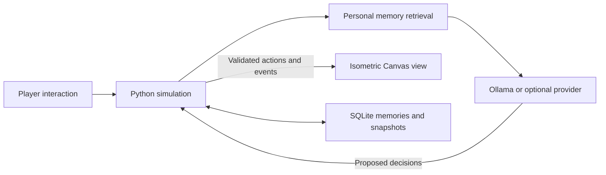

<div align="center">

# Smallworld Agents

**A small town where every resident has a routine, a memory, and somewhere to be.**

A playable **2.5D isometric simulation** with original artwork, autonomous residents, and local language-model cognition through **Ollama**.

</div>

https://github.com/user-attachments/assets/10f2cffd-3cfd-480f-9d2e-4243ba109661

*Watch the one-minute introduction — narrated, captioned, and filmed from a guided offline simulation.* [Read the transcript](docs/media/intro-transcript.md) · [Download the MP4](docs/media/smallworld-agents-intro.mp4) · [Video production notes](tools/video/README.md)

[Quick start](#quick-start) · [Local AI](#bring-the-town-to-life-with-ollama) · [How it works](#how-it-works) · [Roadmap](#roadmap)

Walk into the neighborhood as **Alex**. Meet Maya at the cafe, chat with Samir, or ask someone to bring coffee to Elena. Residents move through the world, remember their own experiences, and carry out requests that you can follow step by step.

Inspired by [Generative Agents: Interactive Simulacra of Human Behavior](https://arxiv.org/abs/2304.03442), Smallworld Agents is an interactive adaptation of its ideas. It combines a language-model layer with a simulation that checks what actually happens.

## What you can do

| Feature | In the town |
| --- | --- |
| Explore | Eight-direction walking, isometric depth, camera pan and zoom |
| Meet residents | Five original residents, expandable to 25 with roles, routines, needs, and relationships |
| Talk | Proximity conversations, speech bubbles, and persistent conversation history |
| Assign errands | Up to six ordered steps: deliver, visit, meet, wait, report, inspect, use, and invite |
| Coordinate meetings | Physical invitations, explicit acceptance or decline, and verified attendance |
| Go indoors | Four furnished cutaway rooms and reserved object use |
| Replay | Scrub recorded world states without regenerating model answers |
| Create a town | Import, edit, validate, and export scenarios; optional browser voice controls |
| Inspect memories | Personal observations, conversations, reflections, and retrieved context |
| Follow progress | Task steps, blockers, cancellations, and completion evidence |
| Keep your town | SQLite autosave and resume for residents, memories, tasks, and inventory |
| Choose cognition | Offline demo, local Ollama, or an optional OpenAI adapter |

**Delivery means delivery.** The resident must collect an item, find its recipient, and transfer it at close range. A language-model reply alone cannot mark the task complete.

## Quick start

**Requirements:** Python 3.11+ and a modern browser. No third-party Python packages or frontend build are required. Node.js is only needed for developer checks and rebuilding asset metadata.

```sh
git clone https://github.com/sumnoon/smallworld-agents.git
cd smallworld-agents
python run.py
```

Open **[localhost:8766](http://127.0.0.1:8766/)**.

A fresh clone starts in **OFFLINE DEMO**: movement and tasks work immediately, with rule-based decisions and template conversations. Press **Ctrl+C** in the terminal to save and stop.

## Bring the town to life with Ollama

With [Ollama](https://ollama.com/) installed, make sure your model is available:

```sh
ollama list
```

The tested model is **`gemma4:31b`**. Use the exact model name shown by your Ollama installation. If needed, obtain it with `ollama pull gemma4:31b`; it is a large download and requires suitable memory.

Copy `.env.example` to `.env`:

```sh
# macOS / Linux
cp .env.example .env
```

```powershell
# Windows PowerShell
Copy-Item .env.example .env
```

Then configure:

```dotenv
AGENT_PROVIDER=ollama
AGENT_MODEL=gemma4:31b
OLLAMA_BASE_URL=http://127.0.0.1:11434
AGENT_MODEL_TIMEOUT=120
AGENT_MAX_REQUESTS=1000
```

Keep Ollama running and restart `python run.py`. The interface displays **OLLAMA LIVE** and the model name. No cloud API key is needed, and the default Ollama endpoint is on your computer.

**Using an Ollama cloud model?** A `-cloud` name such as `gemma4:31b-cloud` still goes through your local Ollama endpoint, which proxies it to `ollama.com`, so run `ollama signin` once and confirm the name appears in `ollama list`. Set `AGENT_MODEL` to the exact `-cloud` name. Cloud-hosted models apply the JSON schema as a prompt hint rather than as constrained decoding, so their answers may arrive wrapped in a markdown fence; the adapter unwraps them before validating the fields.

**Using a custom model folder on Windows?** Start Ollama in a separate terminal with:

```powershell
./tools/start-ollama.ps1 -ModelsDirectory 'D:\path-to-your-models'
```

The helper uses `OLLAMA_MODELS` when set, otherwise the standard user model folder. It accepts `-OllamaExecutable` for a custom installation and changes no global settings. Use it when Ollama is stopped; an existing service must already be configured for the right folder.

### What to expect from local inference

Player requests take priority over queued background decisions. One local inference request runs at a time, with an 8,192-token context, bounded output, and thinking disabled. Residents display **Thinking…** while queued or generating.

Direct tests with `gemma4:31b` produced warm responses in approximately **12–29 seconds** on the development machine; performance depends on your hardware and context length. Start at **1× speed** for slower inference.

The UI shows requests, token usage, and errors. The request cap resets when the simulation server restarts. On a provider error, the adapter waits 30 seconds before retrying and uses demo fallbacks in the meantime. It never switches from Ollama to a cloud provider automatically.

### Semantic memory

Install the optional local embedding model and add its name to `.env`:

```sh
ollama pull embeddinggemma
```

```dotenv
AGENT_EMBEDDING_MODEL=embeddinggemma
AGENT_MAX_EMBED_REQUESTS=500
```

Restart after changing configuration. Embeddings run on the cognition worker, are cached in SQLite, and are never needed to move residents. The tools panel shows retrieval mode, embedding requests, tokens, queue depth, and per-resident operation latency. Missing or failed embeddings use lexical retrieval. Offline demo mode makes no model or embedding calls. See the [Ollama embed API](https://docs.ollama.com/api/embed).

<details>
<summary><strong>Optional OpenAI configuration</strong></summary>

Set `AGENT_PROVIDER=openai`, select a Responses API model supporting structured outputs through `AGENT_MODEL`, and provide `OPENAI_API_KEY` in `.env`. Only selecting that provider sends context to OpenAI, with `store: false`. The key remains on the server.

The OpenAI adapter is covered by mocked tests; no credentialed OpenAI run has been performed.

</details>

## Your first errand

1. Select **Samir** on the map or in the residents panel.
2. Choose **Assign task** and enter: **“Bring a coffee to Elena.”**
3. Alex walks over and makes the request.
4. Watch the task card as Samir collects the coffee, finds Elena, and hands it over.
5. Inspect Elena's inventory and the recorded world events.

**Chat sends a message; Assign task starts a tracked errand.** Flexible language understanding does not add actions the world has not implemented.

| Try this | Result |
| --- | --- |
| “Deliver a parcel to Noah.” | Collect and transfer a parcel |
| “Visit the park.” | Walk to the park |
| “Meet Maya.” | Find Maya and have a conversation |
| “Wait for 2 minutes.” | Wait for two simulated minutes |
| “What do you remember?” in Chat | Discuss retrieved personal memories |

Click walkable ground to move Alex. Drag to pan, scroll to zoom, and use **Recenter** to fit the map. Use the send button or **Ctrl+Enter**. Pause the town or select 1×, 2×, or 4× speed; at 1×, six simulated seconds pass per real second.

Close the cafe to see coffee requests become blocked; reopen it to allow retries. Each resident runs one assigned task at a time. **Pause task** releases them for another errand; **Resume** continues the saved steps and inventory when they are free. Fixed-time meeting requests can be cancelled but cannot be paused. Chat can suggest an errand, which remains proposed until you accept it.

## How it works



The **server owns the world**: positions, navigation, inventory, visibility, simulated time, and task completion. The model interprets requests and generates dialogue, activity choices, and reflections. Returned decisions are validated; stale decisions are discarded when an interaction changes the resident's plan.

The browser renders interpolated snapshots with Canvas. A Python HTTP server sends updates through server-sent events and receives JSON commands. Memory retrieval combines semantic similarity, recency, and importance when an embedding model is configured. It uses lexical similarity when embeddings are disabled or unavailable. Candidates are scoped to the resident's own records. Reflections require accumulated evidence and cite direct memories, keeping inference depth to one.

```text
client/                 Isometric renderer and interaction panels
server/world.py         Simulation, navigation, conversations, and tasks
server/roadmap.py       Task plans, interiors, meetings, replay, and transactions
server/planning.py      Bounded task-plan interpretation
server/memory.py        Worker-side embedding retrieval and cache
server/scenario.py      Scenario validation and population generation
server/model.py         Offline, Ollama, and OpenAI cognition adapters
server/storage.py       Personal memories, event log, and saved state
scenarios/              Town layout and resident personas
assets/                 Original artwork, prompts, and frame metadata
tests/                  Simulation, provider, and HTTP tests
tools/                  Asset inspection, smoke check, and Ollama launcher
IMPLEMENTATION_PLAN.md  Research analysis and development roadmap
```

### Saving and resuming

Every simulation tick and accepted command saves its world changes, events, command receipt, and snapshot in one SQLite transaction at `data/neighborhood.sqlite3`. **Save town** saves immediately, and restarting resumes the saved world. Local settings and saves are excluded from Git.

For another town without changing your existing save:

```sh
python -m server.app --port 8767 --database data/another-town.sqlite3
```

Open **Playback, meetings & town tools** to browse recordings. Playback pauses the live world, then renders checksummed stored snapshots without calling a model. Return to the live town and press **Resume** to continue. Up to 7,201 frames are retained, sampled every six simulated seconds plus commands. This is recorded-state playback, not regeneration from a seed. Model decisions and player commands are also logged in SQLite.

## Original artwork

All artwork was created for this project: AI-generated raster sprite sheets and authored SVG interface icons. The pack includes **six character sheets, 16 terrain tiles, four building exteriors, 16 props, and eight icons**—236 source frames/icons in total.

Generation prompts, measured sprite rectangles, anchors, and facing corrections are retained under `assets/`. Final sheets have verified transparency. See the [asset notes](assets/README.md) for production details and known animation limitations.

For a separate art gallery and eight-facing animation inspector:

```sh
python -m http.server 8765 --bind 127.0.0.1
```

Open [asset-preview.html](http://127.0.0.1:8765/asset-preview.html). This is a scripted art preview; the playable simulation runs on port 8766.

## Development and checks

```sh
python -m unittest discover -s tests -v
node --check client/app.js
node --check client/renderer.js
node --check client/tools.js
node tools/inspect-assets.mjs
python tools/evaluate.py --population 25 --output data/evaluation.json
```

The **48 automated tests** cover the original simulation plus multi-step execution, invitation acceptance and attendance, interior visibility and object reservations, task reprioritization, semantic ranking and fallback, rollback, replay integrity, scenario validation, and resume. CI runs Python tests and checks browser syntax and asset metadata without contacting a live model.

Live Ollama tests passed for task interpretation, dialogue, activity selection, and reflection. Running-server checks also verified physical deliveries and restored saved progress.

`python tools/check-running-simulation.py` runs an additional delivery check against an **offline** server on port 8766. It creates an actual task and consumes one coffee in that saved town.

## Town tools and population

Use the room selector to follow a resident or inspect an interior. **Walk Alex into this room** routes the player through its entrance. Interior object buttons assign a tracked use task to the selected resident.

Try these requests in **Assign task**:

- Bring coffee to Elena then report back.
- Invite Noah and Elena to the park at 4pm.
- Use the bed.
- Inspect the bookshelf.

The scenario editor is under **Playback, meetings & town tools**. It loads the current layout, imports JSON, edits personas and routines, expands the population, and validates a download. Start the exported file with a new database:

```sh
python -m server.app --scenario my-town.json --database data/my-town.sqlite3
# Or use the built-in population generator:
python -m server.app --residents 25 --database data/town-25.sqlite3
```

Additional residents have distinct names and roles and reuse the five original resident sprite sheets. Rooms combine original code-drawn floor and wall layers with existing furniture artwork. Optional browser speech synthesis reads new dialogue; supported browsers can dictate into the message box for review. Browser speech services may use network services, so dictation is not guaranteed to work offline.

## Implementation status and evaluation

The playable roadmap features are implemented in the current Canvas/Python stack. See [implementation status and limits](docs/ROADMAP_IMPLEMENTATION.md) for the acceptance matrix and [evaluation results](docs/evaluation/README.md) for reproducible commands and measurements.

The 25-resident offline workload completed the coffee-and-report plan, preserved inventory uniqueness, and detected no overlaps across 1,200 updates. Its measured 95th-percentile update time was approximately **17 ms** on the development machine. A live `gemma4:31b` call produced the expected two-step plan in **82 seconds**, and a live `embeddinggemma` query retrieved the matching gardening memory. These are engineering checks, not a reproduction of the paper's experiments.

Current limits: one navigable ground level, fixed camera orientation, six original character sheets, rule-based invitation acceptance based on commitments, bounded recorded-state replay, and no external software execution or multiplayer. A human-rated persona/believability study remains outstanding. Browser automation was unavailable during this update; Canvas scenes were rendered and inspected directly, while speech permissions and full browser interactions still need a manual pass.

## References

- [Generative Agents: Interactive Simulacra of Human Behavior](https://arxiv.org/abs/2304.03442) — the research inspiration.
- [Authors' implementation](https://github.com/joonspk-research/generative_agents) — reference architecture and prompts.
- [Ollama chat API](https://docs.ollama.com/api/chat) and [structured outputs](https://docs.ollama.com/capabilities/structured-outputs) — the local cognition interface.
